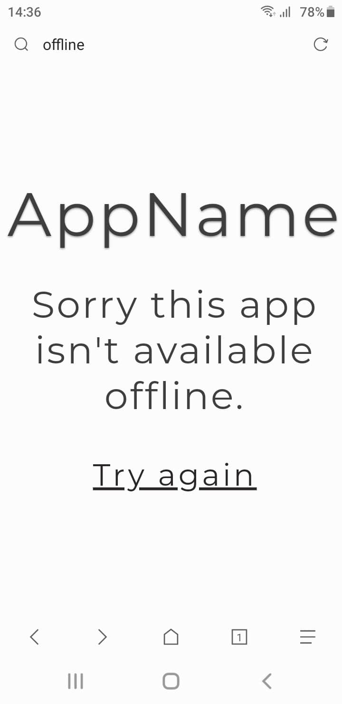

# :star: Simple offline page using Service Workers



##  :question: how this example will work :

1.  We install the Service Worker and then we cache our offline html page.

2.  If an user visits our web page and there is no internet connectivity,we return the cached offline html page.

# :sparkles: how to run the app

To run the app from a local web server,you can use python or php built-in web server.

1. Python
```bash
cd dir/
python -m SimpleHTTPServer 3000
```
2. Php
```bash
cd dir/
php -S localhost:3000
```


